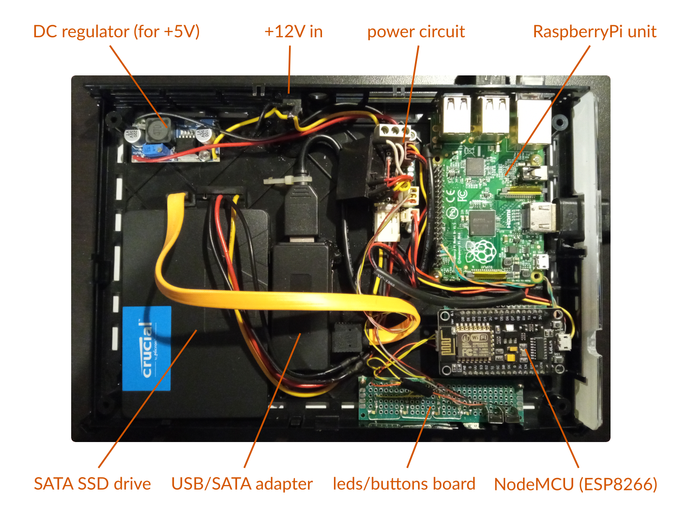
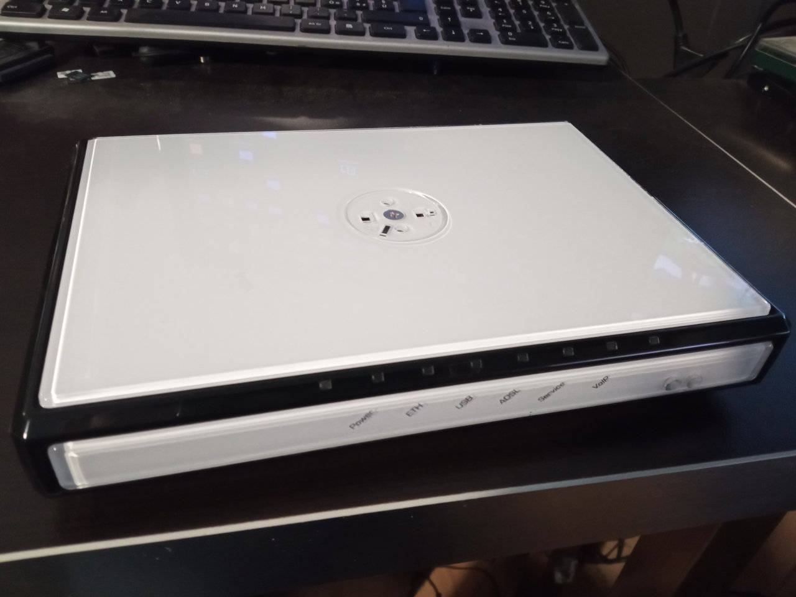
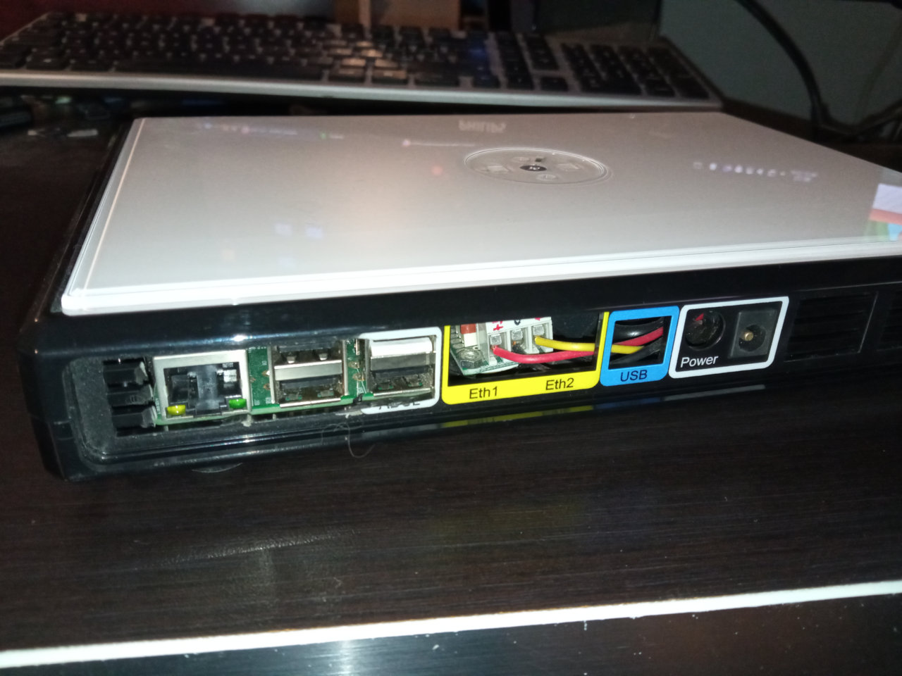
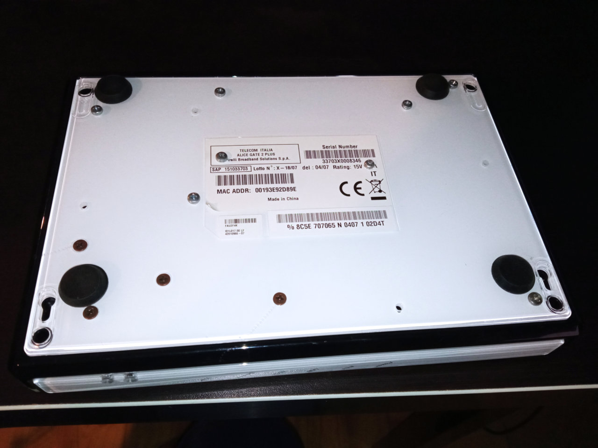
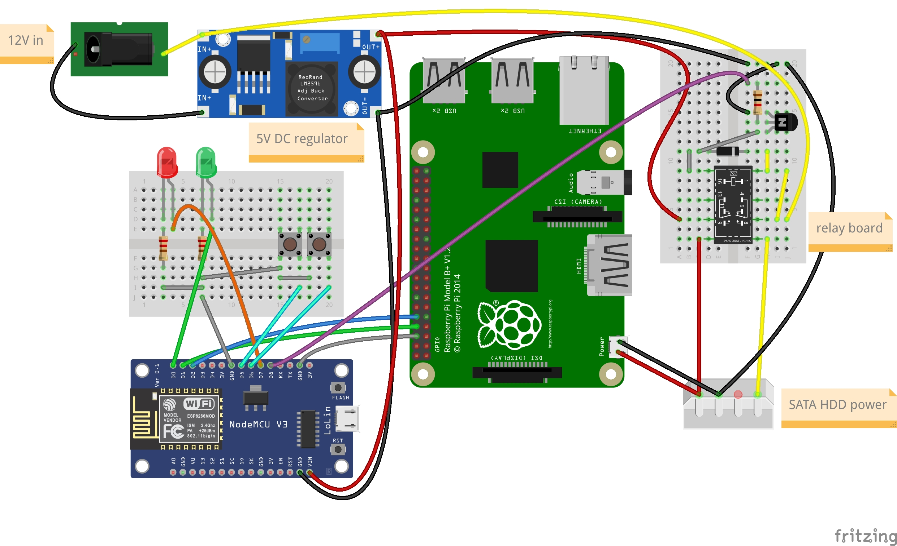

# DataVault - a simple, cheap, and effective backup unit for cloud storage services

## preface
The reason I've built this device is rather simple: I have a private NextCloud instance running on a my small server where I (and my family) store some important data. Since it is not wise to keep "all eggs in one bucket", and since that "two copies are better than one", I made this device to automatically keep a synchronized copy of all my data (from my NextCloud server and from some GDrive accounts) to its SSD drive.

## the device
The device is rather simple: just an old Raspberry Pi model B+, a SATA SSD drive, an USB/SATA adapter, and an ESP8266 MCU board (NodeMCU).
Everything fits perfectly in the case of an old ADSL modem (Alice Gate Plus, by Pirelli/Telecom Italia).

## working principle
Everything is powered by an external 12V DC adapter. In the box there is a DC stepdown regulator for +5V line. These two voltage levels are connected on the "power circuit" board.

The ESP8266 unit is always powered (consuming almost nothing), it's connected to home network via wifi, and it acts as a "timer" for the Raspberry Pi unit. Once a day (in my case during the night), it switches a relay giving power to the Raspberry Pi, that is connected to the network via ethernet cable. Once the RaspberryPi system it's booted, it starts a simple python application that sequentially runs some tasks defined in a json configuration file. Each task spawns an **RClone** (https://rclone.org/) subprocess that connects to the remote cloud repository and *syncs* (in one way mode) all remote files to local SATA SSD drive.

## the ESP8266 unit
Firmware and webservice sources are under **sources/esp8266** folder. The code was written using **PlatformIO** (https://platformio.org/) on VSCode.
Unlike *almost* every ESP8266 firmwares you can find on the network, to connect this device to the WiFi network you don't need to write your network credentials in the sources, since I've added an handy **WPS** feature. You just need to enable WPS on your router, and push the WPS button on the ESP8266 unit (connected to pin D6). Once successfully paired, the device will connect to NTP server, taking current date/time. I've also added a **mDNS** feature, so you can reach its settings page opening the address **http://dvctrl.local/** with a modern browser from your local network.

From the web interface you can see date/time from the device, the power status of the SBC unit (the RaspberryPi), you can turn it on or off, and set/enable/disable the daily activation time.

This simple webpage is built with:
 - **Vue.js** v2 (https://vuejs.org/)
 - **Chota** micro CSS framework (https://github.com/jenil/chota)
 - **notyf** for toast notifications (https://carlosroso.com/notyf/)
 - **reconnectingWs** for websocket communication

## the RaspberryPi unit
Since I'm using an old B+ model, I've installed **DietPi** (https://dietpi.com/)

I've formatted the SATA SSD drive with only one ext4 partition, and mounted under **/mnt/storage**, adding a line in **/etc/fstab**:
    
    UUID=[your UUID here] /mnt/storage ext4 noatime,lazytime,rw,nofail,noauto,x-systemd.automount

You can find the sources for python application **(syncworker)** under sources/raspberrypi/syncworker (in this repository). You need to correctly configure **config.json** file with your tasks (there is a file named config-example.json, to be renamed to config.json).

To create RClone remotes, refer to RClone documentation (https://rclone.org/remote_setup/). In the README file under syncworker folder there is an example to configure GDrive remotes (basically you need to connect to the RaspberryPi system via SSH, and issue some shell commands).

On the DietPi system, I've placed syncworker application folder under /mnt/storage/datavault (the root of SSD partition).

### autostart application at boot (on DietPi)
Since DietPi doesn't have a rc.local file (it uses systemd), you need to put a bash script under **/var/lib/dietpi/postboot.d/**

    nano /var/lib/dietpi/postboot.d/datavault.sh

with this content:

    #!/bin/bash

    systemctl restart systemd-timesyncd

    sleep 2

    cd /mnt/storage/datavault/syncworker
    ./run.sh

then set permissions:

    chmod 755 /var/lib/dietpi/postboot.d/datavault.sh

## electrical connections

